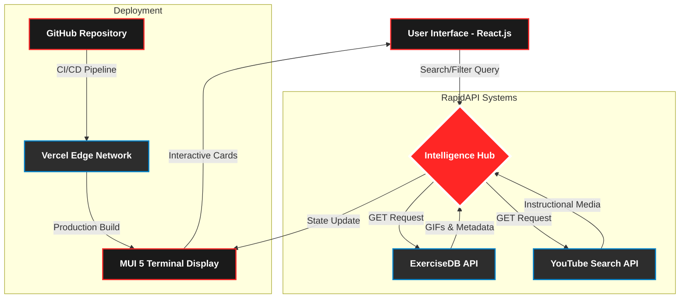
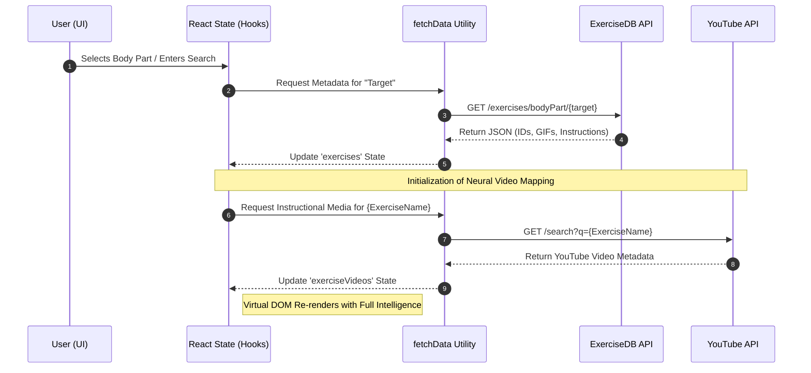
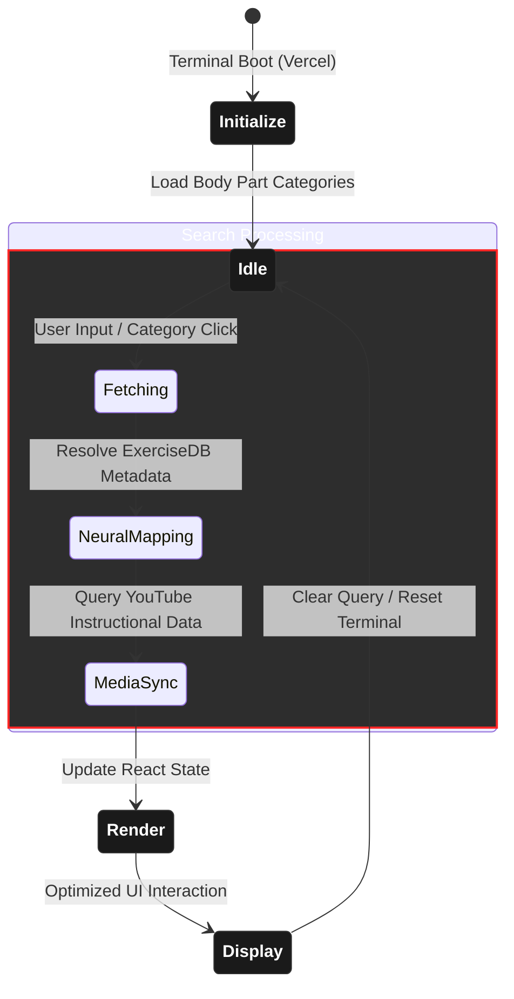

# 🏋️‍♂️ Salony’s Fitness Club

[](https://reactjs.org/)
[](https://mui.com/)
[](https://rapidapi.com/)
[](https://vercel.com/)
[](https://opensource.org/licenses/MIT)
[](https://salony-s-fitness-club.vercel.app/)

<p align="center">
  <a href="https://salony-s-fitness-club.vercel.app" target="_blank" rel="noopener noreferrer">
    
  </a>
</p>

<div align="center">
  <h1>🏋️‍♂️ Salony’s Fitness Club</h1>
  <p>
    <b>A Cinematic AI-Driven Fitness Intelligence Terminal</b><br />
    <i>Discover 1,300+ exercises with real‑time YouTube integration & performance analytics</i>
  </p>

  <p>
    <b>Salony’s Fitness Club</b> is a modern fitness application that helps users discover exercises tailored to specific body parts, target muscles, and equipment. Built with <b>React</b> and <b>Material UI 5</b>, it leverages the <b>ExerciseDB</b> and <b>YouTube Search and Download</b> APIs via RapidAPI to provide high‑quality GIFs, technical details, and instructional videos.
  </p>

  <p>
    <a href="#1-🚀-live-demo"><b>Live Demo</b></a> •
    <a href="#2-🚀-core-features"><b>Core Features</b></a> •
    <a href="#3-🛠️-technical-architecture--stack"><b>Tech Stack</b></a> •
    <a href="#4-🎨-cinematic-visual-experience"><b>UI/UX</b></a> •
    <a href="#5-🏗️-project-architecture"><b>Architecture</b></a> •
    <a href="#6-📦-installation--setup"><b>Installation</b></a> •
    <a href="#7-🔑-api-configuration-guide"><b>RapidAPI Config</b></a> •
    <a href="#8-🚀-deployment-protocol"><b>Deployment</b></a> •
    <a href="#9-🤝-contributing"><b>Contributing</b></a> •
    <a href="#10-👤-author"><b>Author</b></a>
  </p>
</div>

---

## 1. 🚀 Live Demo

- **Status:** Operational 🟢  
- **Host:** Vercel Edge Network  
- **Link:** [https://salony-s-fitness-club.vercel.app/](https://salony-s-fitness-club.vercel.app/)

---

## 2. 🚀 Core Features

### 2.1 🔍 Advanced Neural Search

Seamlessly query a library of **1,300+ exercises**. The intelligent search engine indexes data by exercise names, target muscles, and equipment types to provide instant, relevant results.

### 2.2 🧬 Biometric Categorization

Exercises are segmented into **10+ body‑part categories** (Chest, Back, Cardio, etc.). This allows users to build targeted routines based on specific muscle systems.

### 2.3 📹 Real‑Time Instructional Mapping

Leveraging the **YouTube Search & Download API**, the app dynamically maps technical instructional videos to every exercise. Users receive real‑time visual guidance to ensure proper form and safety.

### 2.4 🦾 Equipment‑Aware Suggestions

The application recognizes required equipment for each movement and suggests **alternative exercises** within the same muscle group or equipment category.

### 2.5 📱 Adaptive Cinematic UI

A fully responsive terminal experience built with **Material UI 5**. The interface maintains its cinematic glassmorphic aesthetic and high‑performance scrolling on mobile and desktop.

### 2.6 ⚡ Performance Optimization

- **Waterfall Data Fetching:** Optimized API calls to reduce latency.  
- **Lazy Loading:** High‑quality GIFs and media assets are loaded only when in view.  
- **Secure Key Management:** Environment‑level security for all RapidAPI credentials.

---

## 3. 🛠️ Technical Architecture & Stack

### 3.1 🏗️ Frontend Core

- **React.js (v18):** Functional components, hooks (`useState`, `useEffect`), and the **Context API** for state management.  
- **Material UI 5:** Industrial‑grade component library with **Emotion‑based** styling.  
- **React Router 6:** Client‑side routing and dynamic parameter handling for exercise details.

### 3.2 🧠 Intelligence & Data Systems

- **RapidAPI – ExerciseDB:** Primary data source providing structured JSON for 1,300+ exercises, high‑res GIFs, and metadata. [web:3][web:6]  
- **RapidAPI – YouTube Search & Download:** Fetches real‑time instructional videos based on exercise names. [web:3]  
- **Fetch API & Waterfall Logic:** Optimized data fetching patterns for low‑latency response.

### 3.3 🎨 Design & UI/UX

- **Glassmorphism & Cinematic UI:** Custom CSS3 + MUI transitions for a premium “Intelligence Terminal” aesthetic.  
- **React Horizontal Scrolling Menu:** Touch‑responsive category navigation.  
- **Responsive Engine:** MUI breakpoints for consistent experience on all screen sizes.

### 3.4 🚀 DevOps & Security

- **Vercel Edge Network:** CI/CD pipeline for global high‑speed delivery. [web:7]  
- **Environment Security:** `.env`‑protected RapidAPI keys to prevent exposure.  
- **Airbnb ESLint Standards:** Enforced code quality and maintainability.

---

## 4. 🎨 Cinematic Visual Experience

<p align="center">
  
</p>

### 4.1 🖥️ High‑Fidelity UI/UX

- **Intelligence Terminal Aesthetic:** Dark‑mode interface with glassmorphic cards and high‑contrast red accents for a focused “Command Center” feel.  
- **Fluid Motion System:** Horizontal scrolling with custom navigation arrows for seamless category exploration.  
- **Dynamic Muscle Mapping:** Visual feedback that highlights “Target Muscle Systems.”  
- **Cinematic Banners:** High‑impact typography and athletic imagery to motivate users on load.

> “Code Your Body, Optimize Your Strength!” — the interface is not just a website; it’s a performance optimization tool for the modern athlete.

---

## 5. 🏗️ Project Architecture

### 5.1 📊 Uni‑Directional Data Flow

The terminal follows a **unidirectional data flow** from user input → API calls → React state → UI render. The diagram below shows the external integrations and deployment pipeline:



### 5.2 🧠 Data Flow Logic

The terminal uses a **synchronized asynchronous pattern** to ensure instructional media is correctly mapped to exercise data:



### 5.3 ⚙️ Operational Workflow

This state‑machine diagram shows the internal logic from boot to user interaction:



### 5.4 🏗️ Terminal Folder Structure

The project follows a modular structure for clear separation of concerns:

```text
Salony-s-Fitness-Club/
├── 📁 public/              # 🌐 Static assets & manifest files
│   ├── 🖼️ banner-hero.png   # ⚡ Primary terminal hero image
│   ├── 📑 favicon.ico
│   └── 📄 index.html        # 🏠 Entry point template
├── 📁 src/
│   ├── 🎨 assets/          # 📦 Global media & design assets
│   │   ├── 📂 icons/       # 🦴 Exercise & body‑part icons
│   │   └── 📂 images/      # 🎬 High‑fidelity banners & logos
│   ├── 🧩 components/      # ⚙️ Reusable UI Intelligence components
│   │   ├── 📜 ExerciseCard.js # 🗂️ Dynamic result cards
│   │   ├── 📜 Navbar.js       # 🧭 Navigation terminal
│   │   ├── 📜 SearchExercises.js # 🔍 Intelligence search bar
│   │   └── ...             # (Detail, Footer, Loader, etc.)
│   ├── 📖 pages/           # 🚀 Primary route views
│   │   ├── 🏠 Home.js         # 📊 Main dashboard
│   │   └── 📑 ExerciseDetail.js # 🧬 Deep‑dive analytics page
│   ├── 🛠️ utils/           # 🧠 Data processing & API services
│   │   └── 📜 fetchData.js    # 📡 RapidAPI neural mapping utility
│   ├── 📜 App.js           # 🛠️ Root component & route manager
│   ├── 🎨 App.css          # 💅 Glassmorphic terminal styling
│   └── 📜 index.js         # 🏁 React DOM initialization
├── 🔐 .env                 # 🔑 Secure credential storage
├── 📏 .eslintrc.js         # 💅 Airbnb code quality config
├── 📐 vercel.json          # 🚀 Deployment optimization
└── 📦 package.json         # 📜 Dependency & script manifest
```

---

## 6. 📦 Installation & Setup

1. **Clone the repository:**

```bash
git clone https://github.com/salonyranjan/Salony-s-Fitness-Club.git
cd Salony-s-Fitness-Club
```

2. **Install dependencies:**

```bash
npm install
```

3. **Set up Environment Variables:**

Create a `.env` file in the root directory and add your RapidAPI key:

```env
REACT_APP_RAPID_API_KEY=your_actual_api_key_here
```

4. **Start the development server:**

```bash
npm start
```

---

## 7. 🔑 API Configuration Guide

### 7.1 📡 Required Endpoints

| System Provider          | Role in Terminal                            | Data Type                                      |
|--------------------------|---------------------------------------------|-----------------------------------------------|
| **ExerciseDB** [web:3][web:6][web:9] | Primary exercise database                   | 1,300+ exercises, body‑part mapping, GIFs     |
| **YouTube Search** [web:3]           | Instructional media lookup                  | Real‑time video tutorials, metadata           |

### 7.2 🛠️ Configuration Steps

1. **Acquire Credentials:**  
   Sign up at [RapidAPI.com](https://rapidapi.com) and subscribe to the **ExerciseDB** and **YouTube Search and Download** APIs (both offer robust free tiers). [web:6][web:9]

2. **Terminal Handshake:**  
   In your root directory, ensure your `.env` file contains your unique API key used for both headers:

   ```env
   REACT_APP_RAPID_API_KEY=your_key_generated_by_rapidapi
   ```

3. **Rate Limit Awareness:**  
   The app is optimized with asynchronous fetching to minimize API calls. However, be aware of free‑tier daily limits to ensure uninterrupted neural search.

---

## 8. 🚀 Deployment Protocol

### 8.1 🌐 Live Production Environment

- **Status:** 🟢 Operational  
- **Deployment URL:** [https://salony-s-fitness-club.vercel.app](https://salony-s-fitness-club.vercel.app)  
- **Infrastructure:** Vercel Edge Network with global CDN and automated SSL.

### 8.2 🔄 CI/CD Pipeline

Every commit to the `main` branch triggers an automated build:

1. **🚀 Trigger:** Push to GitHub Repository.  
2. **🔍 Optimization:** Vercel runs `npm run build` and optimizes assets.  
3. **📡 Deployment:** Bundle is served via the global CDN.  
4. **🔐 Security:** Environment variables (RapidAPI keys) are injected at the edge, never exposed in client‑side code.

### 8.3 🛠️ Manual Deployment

To deploy your own instance:

```bash
# 1. Install Vercel CLI
npm i -g vercel

# 2. Authenticate
vercel login

# 3. Deploy to production
vercel --prod
```

---

## 9. 🤝 Contributing to the Intelligence Terminal

Contributions are what make the open‑source community such an amazing place to learn, inspire, and create. Any contributions you make are **greatly appreciated**.

### 9.1 🛠️ Development Workflow

1. **🍴 Fork the Project:** Create your own copy of the repository.  
2. **🌿 Create a Feature Branch:**

   ```bash
   git checkout -b feature/AmazingFeature
   ```

3. **💻 Commit Your Changes:**

   ```bash
   git commit -m 'Add some AmazingFeature'
   ```

4. **🚀 Push to the Branch:**

   ```bash
   git push origin feature/AmazingFeature
   ```

5. **🔍 Open a Pull Request:** Submit your changes for review.

---

## 10. 👤 Author

**Salony Ranjan**  

<p align="left">
  <a href="https://www.linkedin.com/in/salony-ranjan-b63200280/">
    
  </a>
  <a href="https://github.com/salonyranjan">
    <img src="https://img.shields.io/badge/GitHub-18171
    
    
