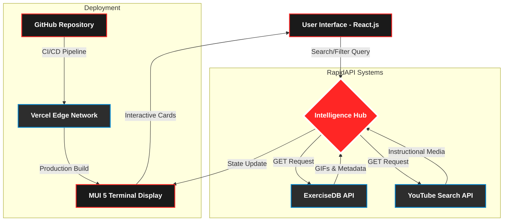
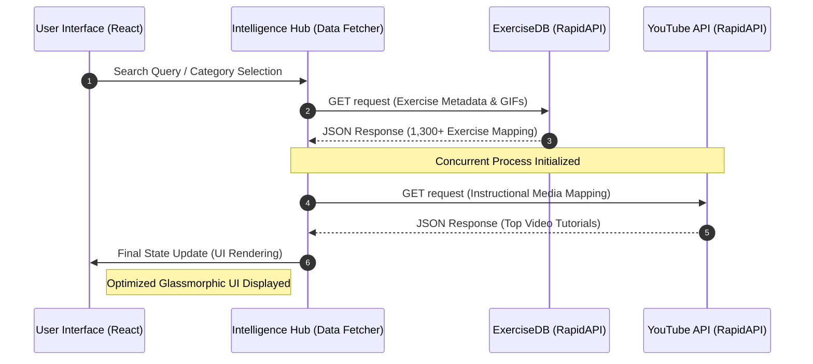
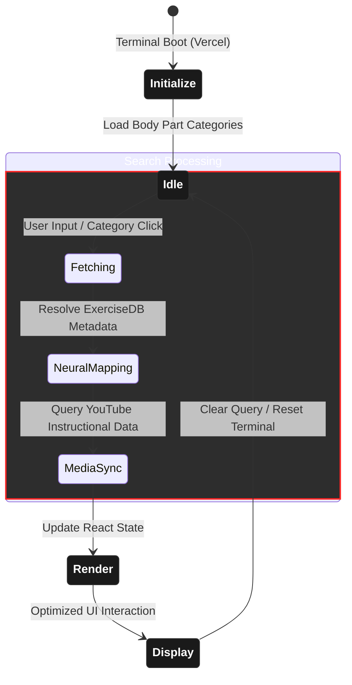

[](https://reactjs.org/)
[](https://mui.com/)
[](https://rapidapi.com/)
[](https://vercel.com/)
[](https://opensource.org/licenses/MIT)
[](https://salony-s-fitness-club.vercel.app/)

<p align="center">
  <a href="https://salony-s-fitness-club.vercel.app" target="_blank" rel="noopener noreferrer">
    
  </a>
</p>

<div align="center">
  <h1>🏋️‍♂️ Salony's Fitness Club</h1>
  <p>
    <b>A Cinematic AI-Driven Fitness Intelligence Terminal</b><br />
    <i>Discover 1,300+ Exercises with Real-Time YouTube Integration & Performance Analytics</i>
  </p>

  <p>
    <b>Salony's Fitness Club</b> is a modern fitness application that helps users discover exercises tailored to specific body parts, target muscles, and equipment. Built with <b>React</b> and <b>Material UI 5</b>, it leverages the <b>ExerciseDB</b> and <b>YouTube Search and Download</b> APIs via RapidAPI to provide high-quality GIFs, technical details, and instructional videos.
  </p>

  <p>
    <a href="https://salony-s-fitness-club.vercel.app"><b>Live Dashboard</b></a> •
    <a href="#features"><b>Core Features</b></a> •
    <a href="#tech-stack"><b>Tech Stack</b></a>
  </p>
</div>

<hr />

## 🌐 Live Dashboard

> **Status:** Operational 🟢  
> **Host:** Vercel Edge Network  
> **Link:** [https://salony-s-fitness-club.vercel.app/](https://salony-s-fitness-club.vercel.app/)

---

## 🚀 Core Features

### 🔍 Advanced Neural Search
Seamlessly query a library of **1,300+ exercises**. The intelligent search engine indexes data based on exercise names, target muscles, and equipment types to provide instant, relevant results.

### 🧬 Biometric Categorization
Exercises are meticulously segmented into **10+ body part categories** (Chest, Back, Cardio, etc.). This allows users to build targeted routines based on specific biological sectors.

### 📹 Real-Time Instructional Mapping
Leveraging the **YouTube Search & Download API**, the system dynamically maps technical instructional videos to every exercise. Users receive real-time visual guidance to ensure perfect form and safety.

### 🦾 Equipment-Aware Suggestions
The application intelligently identifies the equipment required for a movement and suggests **alternative exercises** within the same muscle group or equipment category.

### 📱 Adaptive Cinematic UI
A fully responsive terminal experience built with **Material UI 5**. Whether on mobile or desktop, the interface maintains its cinematic glassmorphic aesthetic and high-performance scrolling.

### ⚡ Performance Optimization
- **Waterfall Data Fetching:** Optimized API calls to reduce latency.
- **Lazy Loading:** High-quality GIFs and media assets are loaded only when in view.
- **Secure Key Management:** Environment-level security for all RapidAPI credentials.

---

## 🛠️ Technical Architecture & Stack

### 🏗️ Frontend Core
* **React.js (v18):** Utilizing functional components, hooks (`useState`, `useEffect`), and the **Context API** for state management.
* **Material UI 5:** Implemented for its industrial-grade component library and flexible **Emotion**-based styling engine.
* **React Router 6:** Managing complex client-side routing and dynamic parameter handling for exercise details.

### 🧠 Intelligence & Data Systems
* **RapidAPI - ExerciseDB:** Primary data source providing structured JSON for over 1,300+ physiological movements and high-res GIFs.
* **RapidAPI - YouTube Search & Download:** Neural mapping system that fetches real-time instructional media based on exercise metadata.
* **Fetch API & Waterfall Logic:** Optimized data fetching patterns to handle interdependent API calls with minimal latency.

### 🎨 Design & UI/UX
* **Glassmorphism & Cinematic UI:** Custom CSS3 and MUI transitions to create a premium "Intelligence Terminal" aesthetic.
* **React Horizontal Scrolling Menu:** Providing a seamless, touch-responsive category navigation experience.
* **Responsive Engine:** Utilizing MUI breakpoints to ensure a "Code Your Body" experience on all screen dimensions.

### 🚀 DevOps & Security
* **Vercel Edge Network:** Continuous Integration and Deployment (CI/CD) for global high-speed delivery.
* **Environment Security:** `.env` protection for sensitive RapidAPI credentials to prevent unauthorized access.
* **Airbnb ESLint Standards:** Ensuring industry-standard code quality, readability, and maintainability.

---

## 🎨 Cinematic Visual Experience

<p align="center">
  
</p>

### 🖥️ High-Fidelity UI/UX
* **Intelligence Terminal Aesthetic:** A premium dark-mode interface featuring glassmorphic cards and high-contrast red accents for a focused, "Command Center" feel.
* **Fluid Motion System:** Integrated **React Horizontal Scrolling** with custom-engineered navigation arrows for seamless category exploration.
* **Dynamic Muscle Mapping:** Visual feedback loops that highlight "Target Muscle Systems," making the biological data intuitive and easy to navigate.
* **Cinematic Banners:** High-impact typography and professional athletic imagery that motivate users the moment the "Terminal" initializes.

 "Code Your Body, Optimize Your Strength!" — The interface isn't just a website; it's a performance optimization tool designed for the modern athlete.

---

## 🏗️ Project Architecture

The following diagram illustrates the **Uni-Directional Data Flow** and the **External Intelligence Integration** within the terminal:



---

## 🔄 Data Flow Protocol

The terminal follows a strictly optimized asynchronous data lifecycle to ensure low-latency performance during the "Neural Search" process:



---

## ⚙️ Operational Workflow

This state-machine diagram visualizes the internal logic of the terminal from the initial boot sequence to user-driven exploration:


---

## 🏗️ Terminal Folder Structure

The project follows a modular directory pattern to ensure high maintainability and clear separation of concerns:

```text
gymvibe/
├── public/                 # Static assets & manifest files
│   ├── banner-hero.png     # Primary terminal hero image
│   ├── favicon.ico
│   └── index.html          # Entry point template
├── src/
│   ├── assets/             # Global media & design assets
│   │   ├── icons/          # Exercise & body-part icons
│   │   └── images/         # High-fidelity banners & logos
│   ├── components/         # Reusable UI Intelligence components
│   │   ├── ExerciseCard.js # Dynamic result cards
│   │   ├── Navbar.js       # Navigation terminal
│   │   ├── SearchExercises.js # Intelligence search bar
│   │   └── ...             # (Detail, Footer, Loader, etc.)
│   ├── pages/              # Primary route views
│   │   ├── Home.js         # Main dashboard
│   │   └── ExerciseDetail.js # Deep-dive analytics page
│   ├── utils/              # Data processing & API services
│   │   └── fetchData.js    # RapidAPI neural mapping utility
│   ├── App.js              # Root component & route manager
│   ├── App.css             # Glassmorphic terminal styling
│   └── index.js            # React DOM initialization
├── .env                    # Secure credential storage
├── .eslintrc.js            # Airbnb code quality configuration
├── vercel.json             # Deployment optimization settings
└── package.json            # Dependency & script manifest
```
---
## 📦 Installation & Setup

1. **Clone the repository:**
 ```bash
 git clone [https://github.com/salonyranjan/GymVibe.git](https://github.com/salonyranjan/GymVibe.git)
 cd GymVibe
 ```

2. **Install dependencies:**
 ```bash
 npm install
 ```
   
3. **Set up Environment Variables:**
Create a .env file in the root directory and add your RapidAPI Key:
 ```bash
REACT_APP_RAPID_API_KEY=your_actual_api_key_here
 ```

4. **Start the development server:**
 ```bash
npm start
 ```
---
